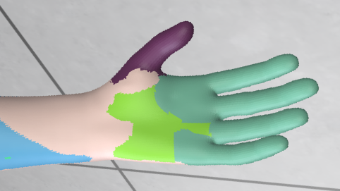
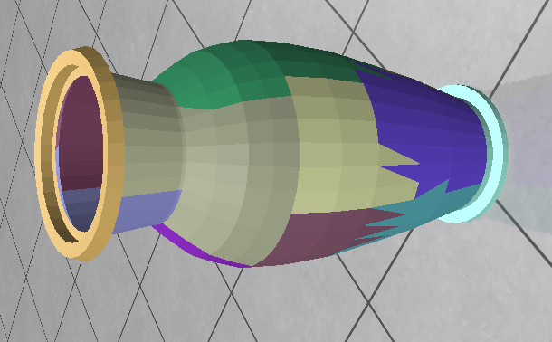
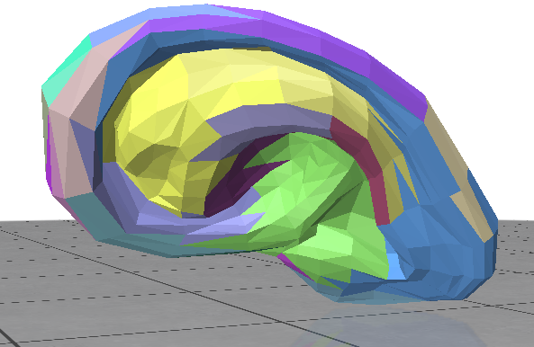
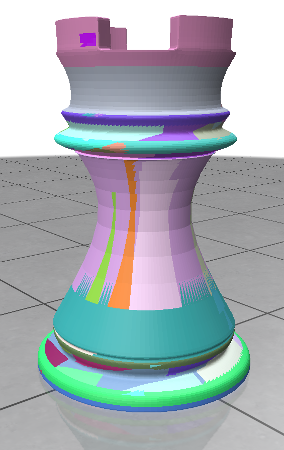

---
# Variational Shape Approximation
## Qu'est ce que la variational shape approximation ? - What is a variational shape approximation ?

Il s'agit d'une approximation de formes à l'aide d'une approche variationelle. 
Cette méthode d'approximation de maillage s'effectue par minimisation d'une erreur entre le maillage d'origine et n ensemble de plans, nommées ici régions ou proxys.
Pour obtenir la minimisation, il est nécessaire d'appliquer un algorithme de clustering sur les triangles du maillage originel, alternant partitionnement et meilleure approximation locale.

It's a shape approximation using a variational approach. 
This mesh approximation method works by minimising the error between the original mesh and n face sets, named proxys.
To get the minimisation, you must apply a clustering algorithm onto the original mesh triangles, while alterning partitionning and best local approximation.

---
## Notre code - Our Code
Notre code permet d'utiliser cette approximation sur une figure .obj choisi. 
Ainsi, un affichage se présente à vous, permettant de déterminer les différetes zones approximées.

Our code allows you to get this approximation for a given .obj file.
Here, a window will show, giving you the several approximated zones.

---

### Son déroulement - His progress
    L'algorithme s'exécute n fois (n paramètre choisi)
	
    Récupération des informations de chaque région actuelle (normale, les faces qui la compose)
	Récupération des faces qui représentent au mieux chaque région (normale proche de celle de la région) -> nommées faces graines
	
    Création d'une file contenant les faces adjacentes aux faces graines

	On assigne à chaque face la région qui lui correspond le mieux, et ce en descendant dans les erreurs

	Enfin, parmi les régions assignées, on rajoute et supprime 3 régions : 
            Une qui sera composé des deux régions avec le moins d'erreur
            Deux qui sont les deux parties de la région avec la plus grande erreur

---
    The algorithm will executes n times (n chosen)
	
    Collect of every proxy information (normal, the included faces)
	Collect of each face that will represent the best each proxy (closest normal from the proxy's normal) -> these are the seed faces
	
    Creation of a file containing all the adjacent faces from the seed faces

	We assign each face to the proxy that correspond the most, from the best to worst error

	To conclude, among the several proxys, we add and delete 3 proxys : 
            One composed of the 2 best adjacent proxys
            Two which are parts of the worst proxy

---
### Différentes options - Several options
1. (Ré-)exécuter l'algorithme n fois, (par défaut une fois)
2. Ajouter une région (va diviser la pire région en deux sous régions)
3. Supprimer une région (va combiner la meilleure paire adjacente de 2 régions)
4. Tirer de nouvelles faces graines
5. Sauvegarder / Charger des régions

---

1. (Re-)execute the algorithm n times, (default is 1)
2. Add a proxy (will divide the worst proxy into 2 subproxys)
3. Remove a proxy (will combine the 2 best adjacent proxys)
4. Redraw new seed faces
5. Save current state / Load old state

---
## Installation

Afin de permette le bon déroulement du programme, veuillez aller dans votre terminal et entrez ces deux commandes :

To execute the program, please go to your terminal and enter those two commands :

---
    
    python -m pip install numpy
    
    python -m pip install polyscope

---
Si vous voyez l'erreur `Python est introuvable. ExÚcutez sans argument pour procÚder Ó l`, essayer d'utiliser comme alias au choix `py`, `python3` ou `py3` à la place de `python`

If you see an error like `Python not found`, try to use one of the alias : `py`, `python3`, `py3` to replace `python`

## Exécution - Execution
Pour lancer le code, il suffit d'ouvrir `kmeans.py` avec l'interpréteur python.

Vous devrez alors choisir la figure à étudier.

Si vous le voulez, ajoutez dans le dossier du programme votre `.obj` favori, et lors de l'exécution, allez dans le 3e menu, et entrez le nom du fichier.

Vient ensuite le choix du nombre de régions :

- Si vous mettez peu de régions (<5), vous obtiendrez des régions très approximatives.
- Si vous mettez beaucoup de régions (>20), vous obtiendrez des régions très spécialisées, cependant faites attention aux temps de calcul.

Après avoir entré le nombre de régions, vous atterrissez sur l'interface de polyscope. En haut à droite se trouve le petit menu répertoriant les différentes options disponibles citées au dessus.

La structure verte à bords noirs est la figure originelle, les faces colorées sont les régions qui vont recouvrir cette figure.

A vous de jouer pour obtenir de belles régions d'approximation !

---

To execute the code, you just have to open `kmeans.py` with the python interpreter.

You will have then to choose which figure to study.

If you like, add in the program's folder you favorite `.obj` file, and during the execution, go the the 3rd menu and enter the filename.

Now goes the choice of how many proxys you want to represent your object :

- Too less proxys (<5) will lead to very approximative proxys.
- Too much proxys (>20) will lead to really specialized proxys, but the performance will drop due to algorithmic complexity.

After you entered your proxys amount, you arrive on the polyscope interface. On the top right, you will see a small menu containing all the option given above.
The green and black structure is the original shape, the colored faces are the newborn proxys that will recover this shape.

It's your turn to play to get the prettiest approximation proxys !

---
## Différentes illustrations - Several illustrations

Découpage d'une sphère avec 15 régions, avec n = 5 -
Sphere spliting with 15 proxys and n = 5

---

Découpage d'un vase avec 15 régions, avec n = 15 -
Vase spliting with 15 proxys and n = 15

---

Découpage d'une oreille humaine avec 30 régions, avec n = 7 -
Human ear spliting with 30 proxys and n = 7

---

Découpage d'un bras avec 22 régions, avec n = 2 -
Arm spliting with 22 proxys and n = 2

---

Découpage d'une tour d'échecs très détaillée avec 100 régions, avec n = 20 -
Detailed chess rook spliting with 100 proxys and n = 20
