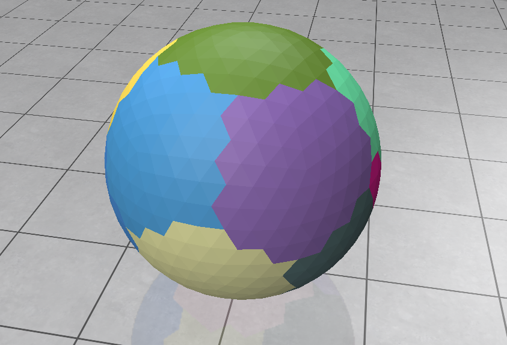
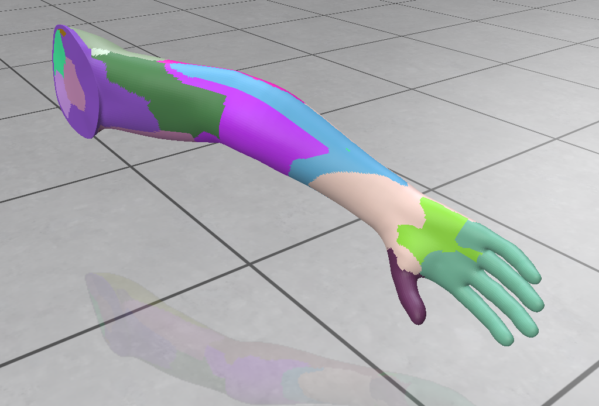

# Variational Shape Approximation
## Qu'est ce que la variational shape approximation ?
Il s'agit d'une approximation de formes à l'aide d'une approche variationelle. 
Cette méthode d'approximation de maillage s'effectue par minimisation d'une erreur entre le maillage d'origine et n ensemble de plans, nommées ici régions ou proxys.
Pour obtenir la minimisation, il est nécessaire d'appliquer un algorithme de clustering sur les triangles du maillage originel, alternant partitionnement et meilleure approximation locale.
## Notre code
Notre code permet d'utiliser cette approximation sur une figure .obj choisi. 
Ainsi, un affichage se présente à vous, permettant de déterminer les différetes zones approximées.

### Son déroulement
    L'algorithme s'exécute n fois (n paramètre choisi)
	
    Récupération des informations de chaque région actuelle (normale, les faces qui la compose)
	Récupération des faces qui représentent au mieux chaque région (normale proche de celle de la région) -> nommées faces graines
	
    Création d'une file contenant les faces adjacentes aux faces graines

	On assigne à chaque face la région qui lui correspond le mieux, et ce en descendant dans les erreurs

	Enfin, parmi les régions assignées, on rajoute et supprime 3 régions : 
            Une qui sera composé des deux régions avec le moins d'erreur
            Deux qui sont les deux parties de la région avec la plus grande erreur

### Différentes options 
1. (Ré-)exécuter l'algorithme n fois, (par défaut une fois)
2. Ajouter une région (va diviser la pire région en deux sous régions)
3. Supprimer une région (va combiner la meilleure paire adjacente de 2 régions)
3. Tirer de nouvelles faces graines
4. Sauvegarder / Charger des régions

## Installation

Afin de permette le bon déroulement du programme, veuillez aller dans votre terminal et entrez ces deux commandes :
    
    python -m pip install numpy
    
    python -m pip install polyscope
    

## Exécution 
Pour lancer le code, il suffit d'ouvrir `kmeans.py` avec l'interpréteur python.

Vous devrez alors choisir la figure à étudier.

Si vous le voulez, ajoutez dans le dossier du programme votre `.obj` favori, et lors de l'exécution, allez dans le 3e menu, et entrez le nom du fichier.

Vient ensuite le choix du nombre de régions :

- Si vous mettez peu de régions (<5), vous obtiendrez des régions très approximatives.
- Si vous mettez beaucoup de régions (>20), vous obtiendrez des régions très spécialisés, cependant faites attention aux temps de calculs.

Après avoir entré le nombre de régions, vous atterrissez sur l'interface de polyscope. En haut à droite se trouve le petit menu répertoriant les différentes options disponibles citées au dessus.

La structure verte à bords noirs est la figure originelle, les faces colorées sont les régions qui vont recouvrir cette figure.

A vous de jouer pour obtenir de belles régions d'approximation !

## Différentes illustrations et applications

Découpage d'une sphère avec 15 régions, avec n = 5

Découpage d'un bras avec 22 régions, avec n = 2

